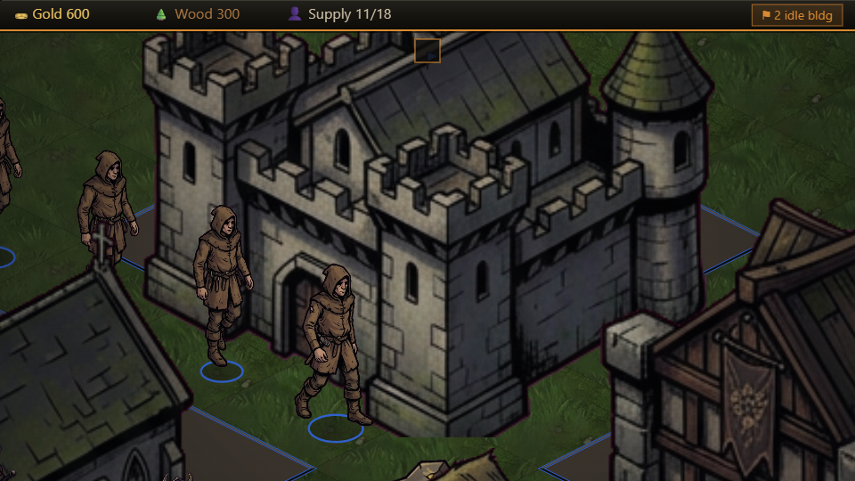

# ⚔ Warlords

A from-scratch, Warcraft-style **isometric real-time strategy** game — built in TypeScript on a hand-rolled Canvas2D renderer with **no game engine**. Grim gothic fantasy in the spirit of *Warcraft × They Are Billions × Darkest Dungeon*: heavy inked outlines, dramatic shadow and rim light, a muted palette with ember accents, and two mirror factions (humans & orcs).

### ▶ [**Play it in your browser**](https://thecareercapitalist.github.io/warlords-rts/)



---

## Features

- **Full RTS loop** — gather gold & wood, build a base, train an army, crush the enemy.
- **Economy** — finite gold mines and forests, peons that haul resources, sawmills that shorten wood trips, farms for supply.
- **Units** — workers, footmen/grunts, archers, mounted knights / wolf-riders, catapults, mages/warlocks (Fireball + Freeze), and griffins/dragons that fly.
- **Combat** — armour, veterancy, focus-fire on wounded targets, splash, spells with autocast; flyers only hittable by ranged.
- **A competitive AI** — manages its economy, expands to distant mines, builds forward bases, fights as a battle line (melee front, archers behind), retreats wounded casters, and defends its base.
- **Animated roster** — every unit has walk, attack/cast, gallop, and wing-flap cycles, plus corpses, building crumble, and combat FX.
- **Polish** — ornate gothic UI framing, a tabbed pause menu with dated save slots, control groups, patrol/hold, minimap, procedural sound effects, and an original score. Plays fully offline.

## Controls

| Action | Input |
| --- | --- |
| Pan camera | **WASD** or arrow keys (speed adjustable in the pause menu) |
| Select / drag-select | Left-click / left-drag |
| Move | Right-click ground · or **M** then click |
| Attack-move | **Ctrl**+right-click · or **Q** then click |
| Attack a target | Right-click an enemy |
| Stop / Hold / Patrol | **X** / **H** / **R** |
| Build (worker selected) | Farm **F** · Barracks **B** · Sawmill **R** · Temple **T** · Forge **G** · Tower **V** · Wall **C** · Enclave **Q** · Town Hall **Z** |
| Cast (mage selected) | Fireball **R** · Freeze **X** — right-click a spell to autocast |
| Control groups | **Ctrl+1–9** assign, **1–9** recall (double-tap to center) |
| Jump to base · Mute · Pause | **Space** · **N** · **Esc** |

On-screen command buttons mirror the hotkeys whenever units or buildings are selected.

## Tech

- **TypeScript + Vite**, rendered on raw **Canvas2D** — no game engine.
- A square simulation grid projected to isometric; decoupled systems (movement, gather, combat, production, AI) communicate via a per-frame event bus.
- All art is **original** (generated, magenta-keyed, sliced into sprite sheets); all audio is **procedural Web Audio** — no third-party assets or IP.

## Develop

```bash
npm install
npm run dev            # Vite dev server → http://localhost:5173
npm run build          # type-check + production build → dist/
npm run build:offline  # bundle everything into one double-click Warlords.html
```

Pushes to `master` auto-build and deploy to GitHub Pages via `.github/workflows/deploy.yml`.

## License / credits

Original game, art, and audio. Not affiliated with Blizzard, Creative Assembly, or any other rights-holder — no third-party IP is used.
